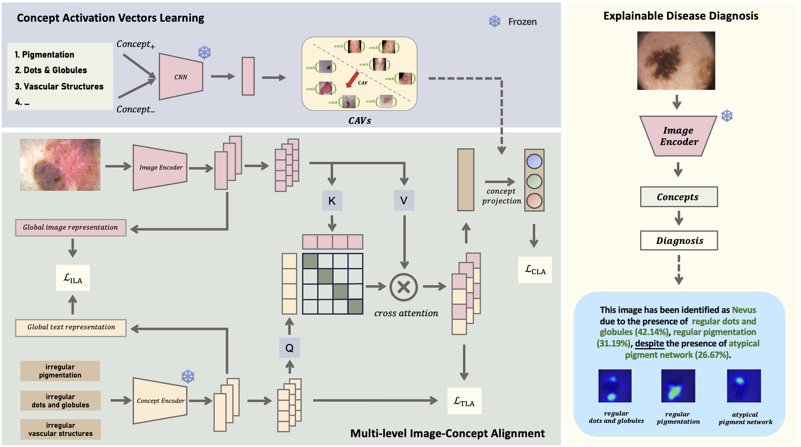

# MICA \:gem:
This is the official implementation of the AAAI 2024 paper *MICA: Towards Explainable Skin Lesion Diagnosis via Multi-level Image-Concept Alignment*.

The complete code will be released soon.
